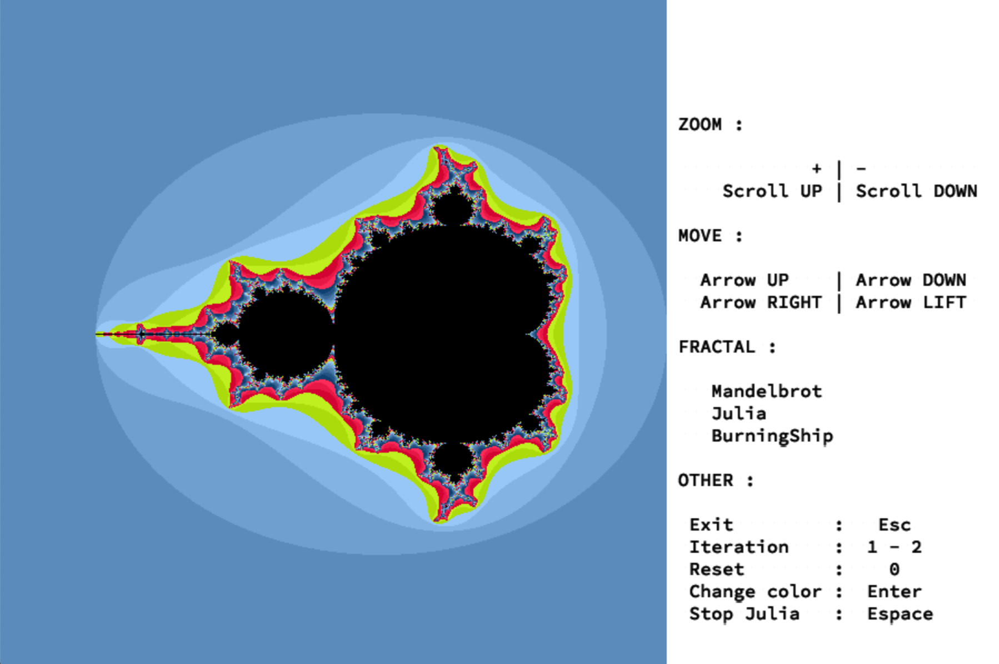
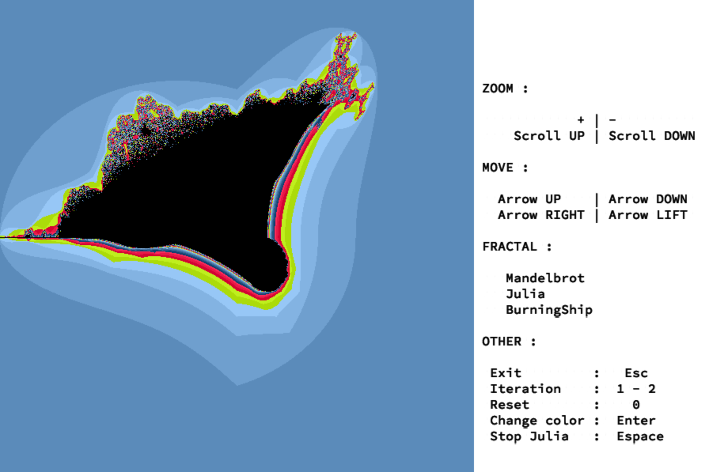
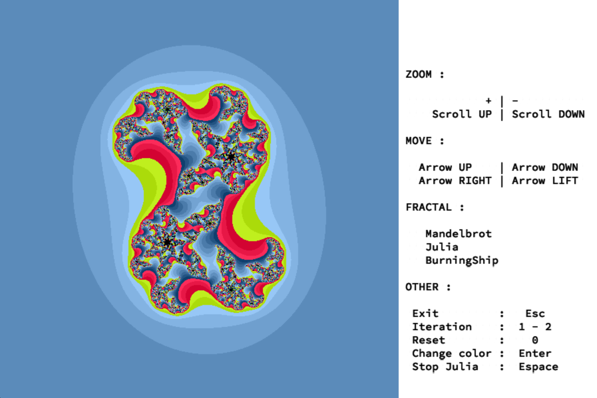

# Fractol

## Overview

A fractal is a never-ending pattern. Fractals are infinitely complex patterns that are self-similar across different scales. They are created by repeating a simple process over and over in an ongoing feedback loop. Driven by recursion, fractals are images of dynamic systems – the pictures of Chaos. Geometrically, they exist in between our familiar dimensions. Fractal patterns are extremely familiar, since nature is full of fractals. For instance: trees, rivers, coastlines, mountains, clouds, seashells, hurricanes, etc. Abstract fractals – such as the Mandelbrot Set – can be generated by a computer calculating a simple equation over and over

## Installation

```bash
make #make an cli named ./fractol
```

## Usage

```bash
./fractol <name>
#name : Mandelbrot,BurningShip,Julia
```

## Screenshots

Mandelbrot</br>
</br>
BurningShip</br>
</br>
Julia</br>

